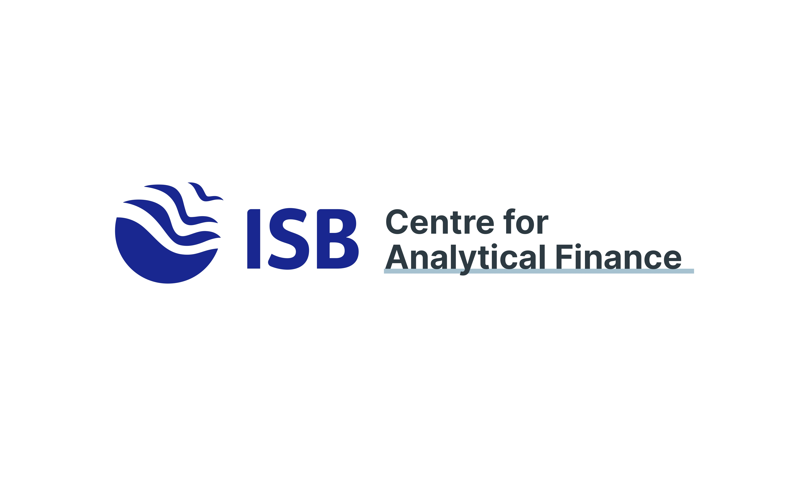

  

# Centre for Analytical Finance (CAF) — Indian School of Business (ISB)

Welcome to the official GitHub organization for the **Centre for Analytical Finance (CAF)** at the **Indian School of Business (ISB)**. 

CAF is a preeminent research centre dedicated to producing cutting-edge, policy-relevant research in all areas of finance. We bridge the gap between academic theory, financial industry practices, and public policy formulation.

---

## Our Mission
Our primary goal is to foster empirical research on financial markets and institutions, particularly in emerging economies. We focus on:
*   **Empirical Finance:** Conducting data-driven investigations into capital markets, corporate finance, and banking systems.
*   **Digital Public Infrastructure (DPI):** Building secure, proprietary technology frameworks and templates that support financial inclusion, security, and legal compliance.
*   **Policy Dialogue:** Collaborating with regulatory bodies, banks, and government fiduciaries to provide actionable analytical insights.

---

## Featured Projects

### [DPDP Consent Management Registry](https://github.com/CAF-Indian-School-of-Business/consent-management)
A compliant, generic, and embeddable Digital Consent Manager system built in accordance with India's **Digital Personal Data Protection (DPDP) Act, 2023**.

*   **Proprietary License:** Fully private and closed-source codebase under copyright by the Centre for Analytical Finance, ISB.
*   **Standard Compliance:** Full alignment with **Section 5 (Notice)**, **Section 6 (Consent & Right of Withdrawal)**, and **Section 13 (Grievance Redressal)** of the DPDP Act.
*   **Modern Aesthetics:** Fully responsive, premium glassmorphism layouts designed for Light Mode.
*   **Security & Auditability:** Integrates a simulated multi-factor authentication (MFA) secure bypass protocol and generates cryptographic audit trail fingerprints (SHA-256) for verification.
*   **Flexibility:** Can be launched as a fullscreen registry portal or embedded as a modal dialog box on top of existing applications (e.g. banking or agricultural dashboards).

---

## Core Research Focus Areas
| Focus Area | Description | Impact & Application |
| :--- | :--- | :--- |
| **Financial Inclusion** | Analysing micro-finance data and Self-Help Groups (SHGs) | Direct policy inputs for rural banking and micro-lending schemes. |
| **Data Protection** | Implementing secure data-sharing consent frameworks | Creating proprietary compliant tech stacks for institutional deployment. |
| **Corporate Governance** | Evaluating board structures and investor protection | Advisory guidelines for Indian capital markets. |

---

## Access & Collaboration
This organization and its repositories contain proprietary, non-open-source systems. Access and collaboration are strictly restricted to authorized researchers, financial fiduciaries, and partner institutions.

*   **Website:** [ISB Centre for Analytical Finance](https://www.isb.edu/en/research-thought-leadership/centers-excellence/centre-for-analytical-finance.html)
*   **Email:** `caf@isb.edu`
*   **Address:** Indian School of Business, Gachibowli, Hyderabad, Telangana - 500111
